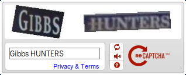
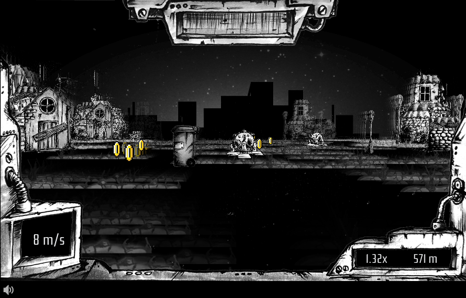
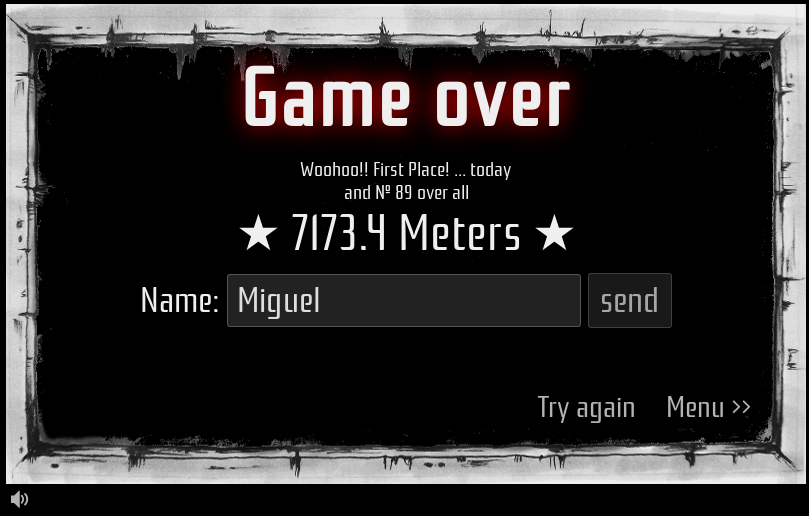
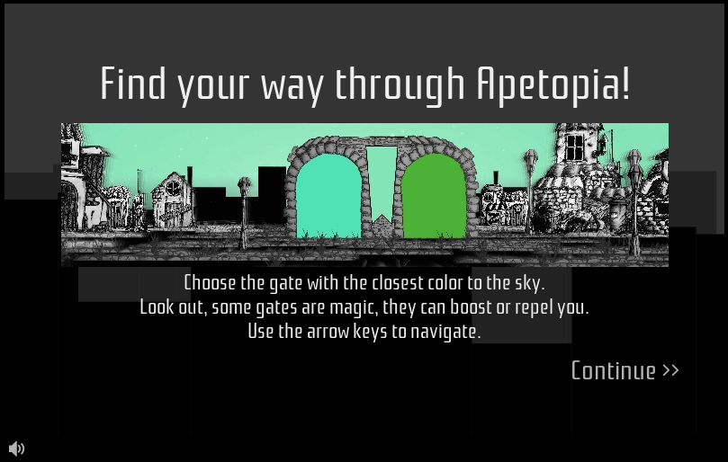
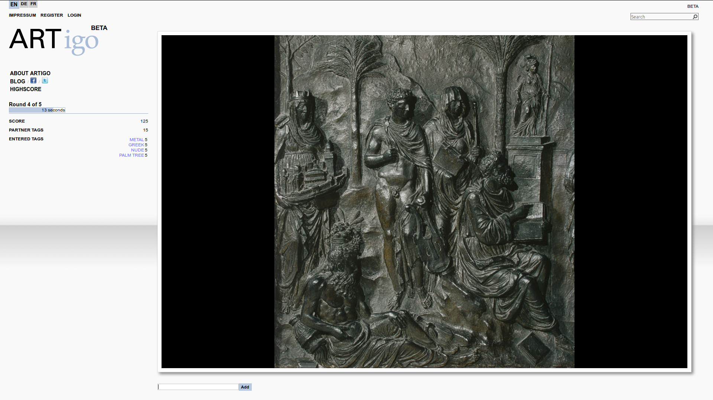
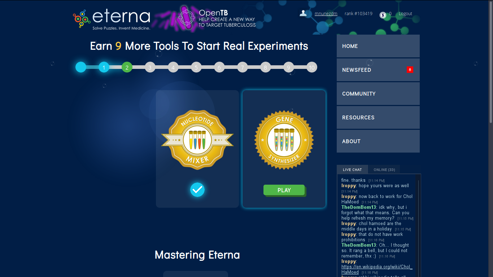
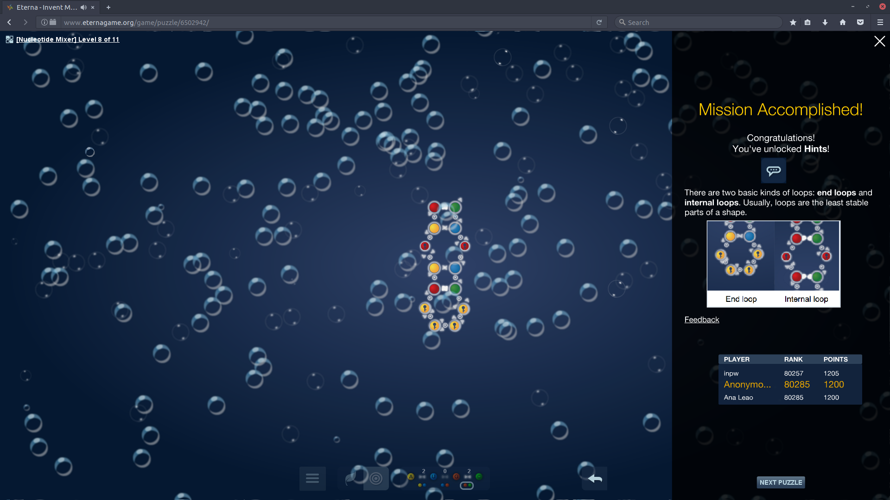
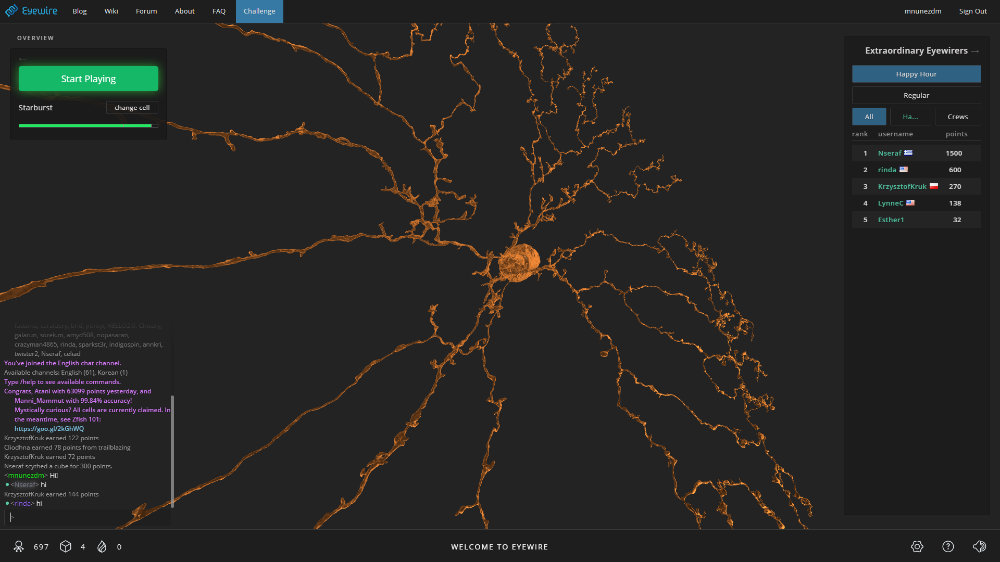

# Estado del arte

Estado del Arte proviene del termino anglosajón *State of Art* (a partir de ahora SoA). SoA se podría traducir de forma no literal al español como Tecnología Punta. En este SoA se van a estudiar las distintas metodologías, así como distintos ejemplos, sobre las que se van a sustentar las posteriores mejoras a implementar.

En concreto se van a estudiar 4 metodologías distintas, estas son, *Crowdsourcing*, Gamificación, *Games with a Purpose* y Sistemas de Reputación.

*Games with a Purpose*, como más adelante se va a ver en profundidad, se podría resumir como la unión de las dos primeras metodologías. Con esto lo que conseguiremos será ofrecer una mejor experiencia de uso, logrando así aumentar el rendimiento del sistema.

Mientras tanto, con un Sistema de Reputación, se va a conseguir implantar un sistema de karma, que permitirá, de forma resumida, dar mayor valor a las interacciones de los usuarios más expertos.

## Crowdsourcing

El Crowdsourcing es una técnica que se basa en la colaboración abierta y distribuida. Actualmente, muchas organizaciones usan el Crowdsourcing para externalizar distintas tareas.

El Crowdsourcing puede resultar muy útil cuando se aplica a campos donde los ordenadores tengan problemas para trabajar y las personas seamos capaces de realizarla sin ningún problema.

También es indispensable para la educación de las Inteligencias Artificiales basadas en *Machine Learning*. En este campo aún es necesario el trabajo de usuarios cuya labor es catalogar distintos *Datasets* para así poder utilizar este conocimiento para clasificar muestras posteriores.

Un ejemplo a destacar de esto último se trata de *reCaptcha*. Los *captcha* son sistemas que utilizan las páginas web para evitar el tráfico de *bots* siguiendo el lema "Fácil para humanos, complicado para ordenadores". Un ejemplo de reCaptcha se puede apreciar en la Figura 1. Originalmente, la finalidad de estos sistemas era simplemente la anteriormente mencionado. En la actualidad, este sistema se utiliza además para el perfeccionamiento de sistemas ROC/*OCR* (Reconocimiento Óptico de Caracteres/*Optic Character Recognition*).

Figura 1: Ejemplo de reCaptcha

El Crowdsourcing, según Geiger & Schader en *Crowdsourcing Information Systems*, se puede dividir en 4 categorías:

+ **Crowdsolving**: Buscan una respuesta heterogénea global entre una gran cantidad de respuestas de un gran colectivo. Se suelen utilizar para encontrar respuestas a problemas complicados.
+ **Crowdcreation**: Usuarios trabajan en común para ofrecer información. Como puede ser Wikipedia o YouTube
+ **Crowdrating**: Sistema basado en votos, la solución aparece por la homogeneidad de los votos. Fue utilizado por la NASA en su aplicación *Clickworkers*, utilizada para detectar cráteres en asteroides
+ **Crowdprocessing**: modelo que se caracterizado por la realización de trabajos por distintas personas, que dos personas realicen el mismo trabajo y obtengan el mismo resultado añade veracidad a la prueba. La unión de todos los resultados es la solución final. Un ejemplo de esto lo podemos encontrar en Galaxy Zoo.

El Crowdsourcing depende de que la gente que esté dispuesta a realizar tareas gratis (o por una pequeña compensación económica). Ya que prácticamente todos los métodos de Crowdsourcing se basan completamente en la información suministrada por los *CrowdSourcees*, mantenerlos motivados es la tarea más importante para conseguir un buen sistema.

El hecho de la auto superación, aprender cosas nuevas o simplemente el hecho de entretenerse suelen predominar a las originadas por el dinero o motivos sociales externos. El objetivo principal es diseñar un sistema que genere sensaciones positivas sobre el Crowdsourcing consiguiendo que quede perfectamente cohesionado.

En la actualidad uno de los campos más estudiados para conseguir estos efectos ha sido el de la gamificación, es por ello que una de las mayores áreas donde se aplica esta sea el Crowdsourcing. Se ha detectado según una gran cantidad de estudios realizados sobre sistemas de Crowdsourcing, una relación directa entre la presencia de sistemas de gamificación y la implicación de los usuarios.

Por esta razón, cuanto mejor aplicada este la gamificación, mayor va a ser la implicación de la gente, ya que muchas veces una compensación económica no es suficiente. Aun así, es importante destacar que no todas las formas de gamificación se pueden aplicar en todos los métodos de Crowdsourcing

## Gamificación

El termino gamificación proviene del inglés, *gamification*, el cual, a su vez, proviene nuevamente del termino anglosajón, *games*. Esto se debe a que, con esta técnica, lo que se pretende, es llevar las técnicas de los juegos a otros ambientes. Al hacerlo, lo que conseguimos es aumentar la fidelización y la atracción del sistema, consiguiendo así aumentar el volumen de usuarios activos.

Esta palabra es relativamente nueva, apareció al rededor del 2008 en el ámbito empresarial. Y ha visto como aumentaba rápidamente su popularidad en los últimos años. Además, no se prevé que no sea una tendencia temporal, estudios como el realizado por el IEEE en *Everyone's a Gamer* avisan de que para el 2020 el 85% de las tareas diarias estén gamificadas.

Para entender porque la gamificación ha tenido tanta importancia en los últimos años hay que comprender el contexto del término del que proviene, los juegos, más concretamente los videojuegos.

Según *The Entertainment Software Association* en su informe sobre 2016 [1] podemos sacar 3 datos muy interesantes sobre los juegos en Estados Unidos:

+ Indican que en el 65% de los hogares hay al menos un dispositivo que puede ser utilizado para jugar.
+ Que hay unos 155 millones de jugadores habituales, es decir, que juegan más de 3 horas por semana.
+ Que se gastaron un total de 23.5 billones de dólares en juegos en 2015.

Estas cifras aumentan año tras año y se espera que siga así.

Una combinación de las dos técnicas vistas hasta este momento, *Crowdsourcing* y Gamificación, es la técnica de *Games With a Purpose* que veremos en el siguiente apartado.

### Componentes de la Gamificación

Para la definición de los componentes de la gamificación se ha decidido seguir un modelo derivado del desarrollado por la empresa gamemarketing, el cual divide en 9 componentes el sistema. En el modelo de cazasteroides vamos a dividirlo en 6 componentes, pues son los que este trabajo requiere.

Los cambios frente a este modelo, consistirían en la unión de las mecánicas y los componentes; la unión de comportamientos y dinámicas; y por último se han eliminado costes y beneficios pues
no se va a tener en cuenta en este trabajo.

Estos componentes serían los siguientes.

+ **Plataformas**: Son los distintos sistemas sobre los que se va a desarrollar la aplicación y sobre los que se va a tener acceso.
+ **Mecánicas**: son los componentes que forman el juego. Pueden ser tanto jugables como no.
+ **Dinámicas**: definen como los jugadores interactúan con las mecánicas del juego.
+ **Estéticas**: muestran cómo se tiene que sentir un usuario al realizar determinadas acciones.
+ **Comportamientos**: patrones que se espera que los usuarios tengan al utilizar el sistema.
+ **Jugadores**: Tipos de usuarios que va a haber en el sistema y sobre los que hay que desarrollar los comportamientos. Según Richard Bartle en su libro *Designing Virtual Worlds*, en un juego, se suelen determinar 4 patrones distintos de usuarios, estos son:
    + **El ambicioso**: busca ganar por encima de todo. Dando importancia a los rankings se mantienen a este tipo de usuarios, sobre todo si en ellos aparecen sus amigos o compañeros.
    + **El triunfador**: tipo de jugador cuya principal motivación es la de descubrir la mayor cantidad de contenido, obtener todos los logros y reconocimientos. Muy ligado al anterior tipo e jugador.
        + **El sociable**: su interés es social por encima de estratégico. Intenta compartir todos sus logros con el fin de aumentar su red de contactos. Le mantiene el poder relacionarse con los distintos jugadores.
    + **El explorador**: jugador cuya motivación es la auto superación, superar los desafíos más complejos o ser el primero en encontrar la solución.

## Games With a Purpose

*Games with a Purpose* (a partir de ahora GWAP) o *Human-Based Computation Games* es una técnica de Crowdsourcing gamificada. Fue propuesta en 2004 por Luis von Ahn con el juego llamado ESP. Este empresario guatemalteco es uno de los pioneros del Crowdsourcing, además del creador de *reCAPTCHA*, anteriormente mencionada, y *Duolingo*, una de las mayores plataformas para el estudio de idiomas.

El fin de esta técnica es que las personas realicen el trabajo que los ordenadores no pueden realizar por si solos. Estas tareas son triviales para los humanos, pero complicadas para los ordenadores, por ejemplo, se pueden tratar de reconocimiento de formas o para la realización de estudios donde la interacción humana es requisito. Al utilizar esta técnica, las personas realizamos tareas simples las cuales, al unirlas forman algo mucho más grande. Pero el problema que tiene esta mentalidad es que los humanos necesitamos algún tipo de incentivo para realizar las tareas, aquí es donde entran en escena los juegos. La motivación principal de los GWAP es la de entretener por encima del interés de realizar tareas. Esto ayuda a que estos juegos puedan ser acogidos por una gran cantidad de personas. 

Los campos sobre los que se pueden aplicar estas técnicas son innumerables ya que es una técnica flexible que permite adaptarse a cualesquiera que sean las necesidades. En el siguiente punto veremos ejemplos de juegos donde se han utilizados estas técnicas.

### Ejemplos de *Games With a Purpose*

#### Apetopia

Apetopia es un juego desarrollado por la empresa Visual Computing. Este juego se trata del típico *endless runner* en el cual tendrás que ir avanzando recogiendo monedas, las cuales aumentan los puntos al igual que la distancia recorrida. Mientras tanto se deben ir esquivando los objetos que aparecen los cuales disminuyen la vida, mostrado en la Figura 2. Al finalizar el juego puedes introducir un nombre para que aparezca en el ranking global además de tu posición en este, Figura 3. Además, se puede ver el estado del ranking global, Figura 4.

Figura 2: Apitopia: Pantalla del juego

Figura 3: Apitopia: Posición y puntuación total

Figura 4: Apitopia: Ranking

La tarea escondida dentro de este juego es la de educar al ordenador sobre como las personas percibimos la diferencia entre los colores. Esto está implementado en forma de portales. Cada cierta distancia aparece un muro de piedra y dos portales con distintos colores, el usuario tiene que pasar a través del que crea que más se parece al cielo. Esto se puede apreciar en la Figura 5.

Figura 5: Apitopia: Puertas

#### ARTigo (Nuevo ESP)

Siguiendo la estela del ESP, el primero GWAP, ARTigo es un juego de etiquetado de imágenes, se presenta una imagen en pantalla durante 60 segundos, al finalizar este tiempo se presenta una nueva. Durante este minuto, hay que añadir etiquetas, si el sistema la detecta como probable te otorga puntos, esto se puede ver en la Figura 6. Cuando finaliza la secuencia de imágenes aparecen los resultados finales y te dan una puntuación final y una posición en el ranking, Figura 7.

Figura 6: ARTigo: Pantalla del Juego

Figura 7: ARTigo: Pantalla de Rankings

#### EteRNA

EteRNA es un juego gamificado cuyo fin es el de ayudar a los ordenadores a mejorar las predicciones sobre como las cadenas de ARN (Ácido Ribonucleico) se doblan. Algunas de las soluciones planteadas son probadas en la realidad y comparadas con los resultados obtenidos.

No se necesita ningún tipo de conocimientos previos para utilizar este sistema ya que tiene un tutorial en los primeros niveles, tras esto, se podrán empezar a realizar experimentos reales, como podemos apreciar en la Figura 8.

Figura 8: EteRNA: Pantalla Principal

Cuando completamos un nivel aparece un ranking según la puntuación obtenida, además de una pequeña tenemos un sistema de puntuación con rankings en cada nivel, cuando completamos un nivel tenemos un recordatorio sobre cómo se unen los distintos componentes del RNA, como se puede ver en la Figura 9.

Figura 9: EterRNA: Pantalla nivel completado

#### Eyewire

Eyewire es una aplicación para el mapeado de neuronas. Estas imágenes se obtienen de la retina de un ratón. Para la realización de estos reconocimientos se dividen las imágenes en zonas de unos 4,5 micrones donde ya está descubierta parte de la neurona y se tienen que descubrir el resto del sector. No se necesita ningún tipo de trasfondo científico.

La primera vez que se abre la aplicación, y tras registrarte, el uso de la aplicación resulta muy sencillo al ser correctamente guiado. Tras unas primeras pantallas de tutorial donde las ayudas van excrementándose hasta finalizar el tutorial y empezar a mapear nuevas zonas.

Esta aplicación posee el sistema de gamificación más completo de los que se han estudiado para este trabajo. Algunas de las dinámicas implementadas en este sistema son las siguientes:

+ **Sistema de puntuación**: el cual depende de velocidad, habilidad y precisión de la observación.
+ **Sistema de Ranking**: el cual podríamos dividir por bloque de fechas (hoy, esta semana, este mes), y por el grupo de gente que aparece (global, solo amigos).
+ **Insignias**: obtenidas al completar desafíos o ir completando sectores.
+ **Niveles**: posee un sistema de niveles en función del trabajo desarrollado, estos otorgan mayores privilegios en el sistema.
+ **Retos**: que permiten desafiar a tus amigos.

En la Figura 10 podemos apreciar la pantalla de finalización de un mapeado con las distintas dinámicas.

Figura 10: Eyewire: Pantalla nivel completado

## Reputation Systems

Los *Reputation Systems* o Sistemas de Reputación son programas que permiten valorar a los usuarios según las acciones que han realizado con el fin de otorgarles credibilidad a ellos mismos y por lo tanto a las acciones que realizan.

Los Sistemas de Reputación actualmente son usados de la misma manera que los sistemas de gamificación, además de para otras razones que veremos más adelante, y es muy común verlos juntos. De la misma manera que en los sistemas gamificados se premia la cantidad de las aportaciones, en los sistemas de reputación prima la calidad de estas. Esto quiere decir que en un sistema de reputación realizar una aportación errónea penalizaría al usuario mientras que en un sistema gamificado simplemente no aportaría nada.

El objetivo de estos sistemas es asegurar un sistema confiable esto se consigue asegurando que los componentes lo sean, por lo tanto, con un sistema donde se premie estas acciones; y además tengan más valor las acciones realizadas por personas confiables se permitirá llegar a este sistema buscado.

### Componentes de los Sistemas de Reputación

La reputación en estos sistemas se puede obtener de distintas formas, como, por ejemplo, según indica la página feverbee, se pueden dividir en 7 distintas maneras. Todos estos componentes se pueden implementar en el mismo sistema, siempre y cuando estén correctamente utilizados. Los componentes son los siguientes:

+ **Por Niveles de Acceso**: dar distintos niveles (de cosas que pueden hacer) a distintos usuarios del sistema con el fin de eliminar tareas automáticas del sistema. Esta herramienta suele ser utilizada en comunidades, a modo de dar privilegios de moderador a usuarios permitiéndoles eliminar contenido, bloquear usuarios etcétera.
+ **Por Antigüedad**: premiar a los usuarios más antiguos del sistema, esto ayuda a mantener a los usuarios más antiguos.
+ **Por Cantidad de Contribuciones**: premiar a cada contribución, esto ayuda a que los usuarios sean más activos, aunque esta herramienta, con el fin de evitar que se haga mal uso de ella, debe ser implementada junto a otras.
+ **Por Calidad de Contribuciones**: herramienta principal de los sistemas de reputación donde se premia a los usuarios por buenas contribuciones y se penaliza por malas.
+ **Por Frecuencia**: realizar contribuciones de forma regular aumenta la reputación.
+ **Por Distinciones Especiales**: otorgar insignias positivas o negativas por acciones realizadas, estas acciones no deberían ser las relacionadas con las actividades principales del sistema, pues de eso ya se encarga la herramienta de Calidad de las Contribuciones vista anteriormente. En esta, una mala acción supondría una insignia que reste reputación, como por ejemplo una disputa fuera de tono con otro usuario o violar las reglas del sistema; mientras que una buena otorgaría un distintivo que aporte reputación, como podría ser una donación.
+ **Por Ranking**: los resultados en los rankings añaden respeto.

### Ejemplos de Sistemas de Reputación

+ **Portales de ventas**: es uno de los campos donde en más porcentaje se usan sistemas de reputación. Resulta difícil encontrar un portal de *eCommerce* donde no se valore los artículos, vendedores o compradores. El fin de aplicar estas técnicas varía según donde se realice, por ejemplo:
    + **En vendedores**: en portales como Aliexpress o eBay resulta imprescindible tener una alta reputación, pues va muy ligada a las ventas que se obtienen, algo que refleja claramente esta postura es el comportamiento de los vendedores ante cualquier problema, donde proceden al reenvío o devolver el dinero con tal de no obtener una mala valoración, y en el caso de no obtener las 5 estrellas, te escriben por privado preguntándote si has tenido algún problema.
    + **En productos**: destacar las valoraciones de productos que tiene Amazon. Esta empresa, a los artículos con mayor valoración se encarga ella misma de realizar la distribución y el servicio post venta, aumentando asi la visibilidad de ellos. Actualmente no creo que haya nadie que compre artículos de otras alternativas cuando Amazon Premium esté disponible.
    + **En compradores**: cobra la mayor importancia en portales de venta de segunda mano donde los vendedores quieran evitar en gran medida un fraude. Esto puede verse en sistemas como WallaPop.
+ **Comunidades online**: otro de los capos donde resulta muy común añadir estos sistemas es en foros o comunidades. Como por ejemplo XDA, el mayor portal de desarrolladores móviles, donde, por ejemplo, solo los usuarios expertos pueden comentar en distintos temas.
+ **Motores de Búsqueda**: todos los grandes motores de búsqueda tienen complejos sistemas de *rankeo* donde premian, es decir, ordenan en función de los valores obtenido de esta puntuación los resultados obtenidos.
+ **Seguridad Online**: portales como TrustedSource, solución ofrecida por Intel y McAfee, catalogan sitios según su tipo y según las vulnerabilidades que pueden tener.

## Referencias

(1) https://es.wikipedia.org/wiki/Estado_del_arte

(2) https://es.wikipedia.org/wiki/Crowdsourcing

(3) https://es.wikipedia.org/wiki/ReCAPTCHA

(4) http://www.gamificación.com

(5) http://www.prnewswire.com/news-releases/everyones-a-gamer---ieee-experts-predict-gaming-will-be-integrated-into-more-than-85-percent-of-daily-tasks-by-2020-247100431.html

(6) http://www.gamkt.com/implementa/gamification-model-canvas/

(7) https://jboadac.com/2013/03/05/diferencia-entre-las-mecanicas-y-dinamicas-de-los-juegos-en-fidelizacion/

(8) http://justificaturespuesta.com/gamificación-7-claves-para-entender-que-es-y-como-funciona/

(9) http://noticias.iberestudios.com/que-es-gamificación/

(10) https://es.wikipedia.org/wiki/Ludificaci%C3%B3n

(11) https://en.wikipedia.org/wiki/Human-based_computation_game

(12) http://gameswithpurpose.org

(13) https://www.cmu.edu/homepage/computing/2008/summer/games-with-a-purpose.shtml

(14) http://apetopia.visual-computing.com

(15) http://www.artigo.org/

(16) http://www.eternagame.org/web/

(17) http://eyewire.org

(18) https://en.wikipedia.org/wiki/Reputation_system

(19) https://www.feverbee.com/reputationsystems/

## Bibliografia

[1] https://pdfs.semanticscholar.org/e8c6/f13256b9423c67c59599b283cca868a5649e.pdf

[2] http://ieeexplore.ieee.org/document/7427729/

[3] http://www.theesa.com/wp-content/uploads/2016/04/Essential-Facts-2016.pdf
