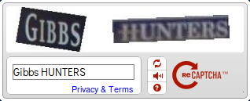
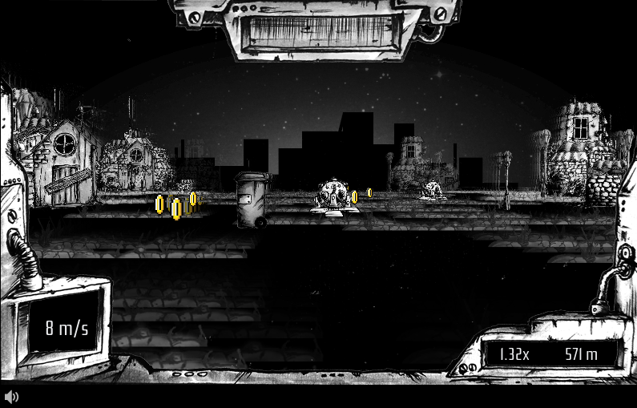
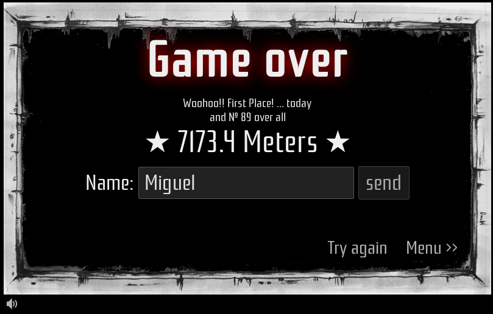
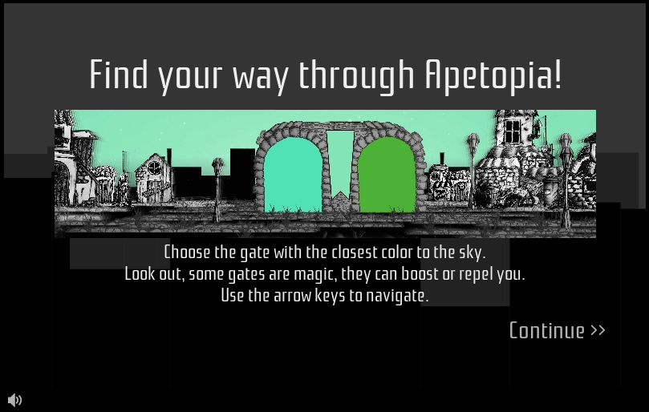
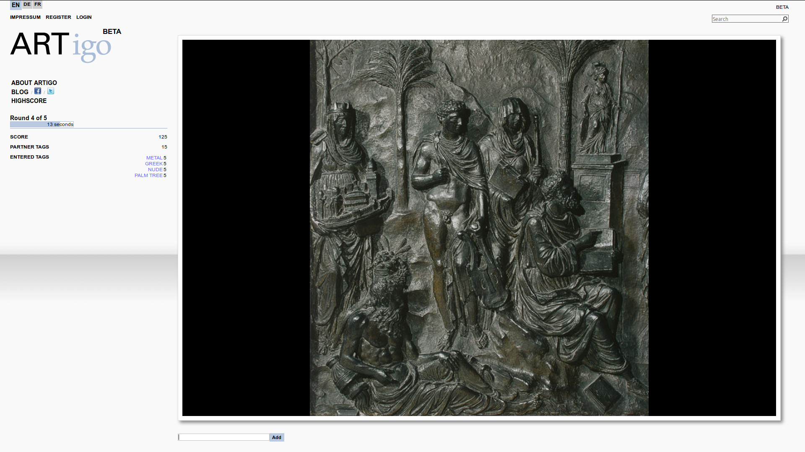
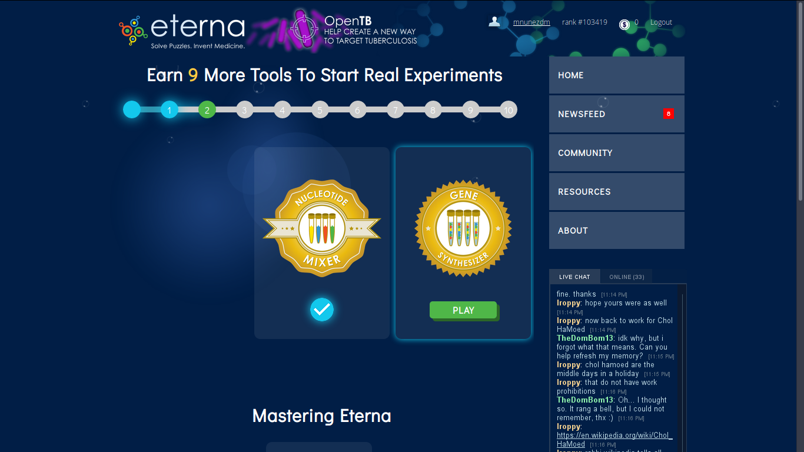
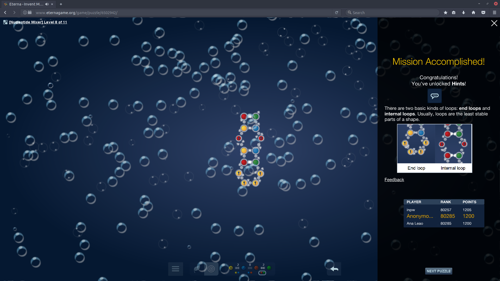
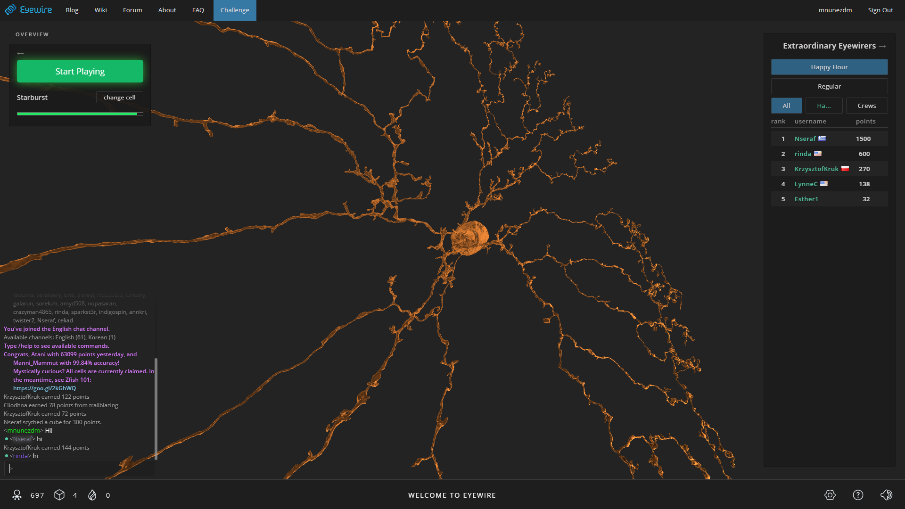

# Estado del arte

## CrowdSourcing

El CrowdSourcing es una técnica que se basa en la colaboración abierta y distribuida. Actualmente, muchas organizaciones usan el CrowdSourcing para externalizar distintas tareas.

El CrowdSourcing puede resultar muy útil cuando se aplica a campos  donde los ordenadores tengan problemas para trabajar y las personas seamos capaces de realizarla sin ningun problema.

También es indispensable para la eduación de las Inteligencias Artificiales basadas en Machine Learning. En este campo aún es necesario el trabajo de usuarios cuya labor es catalogar distintos *Datasets* para así poder utilizar este conocimiento para clasificar muestras posteriores.

Un ejemplo a destacar de esto último se trata de reCaptcha. Los captcha son sistemas que utilizan las paginas web para evitar el trafico de bots siguiendo el lema "Facil para humanos, complicado para ordenadores". Un ejemplo de reCaptcha se puede apreciar en la Figura 1. Originalmente, la finalidad de estos sistemas era simplemente la anteriormente mencionado. En la actualidad, este sistema se utiliza ademas para el perfeccionamiento de sistemas ROC/*OCR* (Reconocimiento Optico de Caracteres/*Optic Character Recognition*).

Figura 1: Ejemplo de reCaptcha

El CrowdSourcing, segun Geiger & Schader en *CrowdSourcing Information Systems*, se puede dividir en 4 categorias:

+ **Crowdsolving**: Buscan una respuesta heterogenea global entre una gran cantidad de respuestas de un gran colectivo. Se suelen utilizar para encontrar respuestas a problemas complicados.
+ **Crowdcreation**: Usuarios trabajan en comun para ofrecer informacion. Como puede ser Wikipedia o Youtube
+ **Crowdrating**: Sistema basado en votos, la solucion aparece por la homogeniedad de los votos. Fue utilizado por la NASA en su aplicacion Clickworkers, utilizada para detectar crateres en asteroides
+ **Crowdprocessing**: modelo que se caracterizado por la realizacion de trabajos por distintas personas, que dos personas realicen el mismo trabajo y obtengan el mismo resultado añade veracidad a la prueba. La union de todos los resultados es la solucion final. Un ejemplo de esto lo podemos encontrar en Galaxy Zoo.

El CrowdSourcing depende de que la gente que esté dispuesta a realizar tareas gratis (o por una pequeña compensación económica). Ya que practicamente todos los metodos de CrowdSourcing se basan completamente en la informacion suministrada por los *CrowdSourcees*, mantenerlos motivados es la tarea mas importante para conseguir un buen sistema. 

El hecho de la autosuperación, aprender cosas nuevas o simplemente el hecho de entretenerse  suelen predominar a las originadas por el dinero o motivos sociales externos. El objetivo principal es diseñar un sistema que genere sensaciones positivas sobre el CrowdSourcing consiguiendo que quede perfectamente cohesionado. 

En la actualidad uno de los campos mas estudiados para conseguir estos efectos ha sido el de la gamificación, es por ello que una de las mayores areas donde se aplica esta sea el CrowdSourcing. Se ha detectado segun una gran cantidad de estudios realizados sobre sistemas de CrowdSourcing, una relacion directa entre la presencia de sistemas de gamificación y la implicacion de los usuarios.

Por esta  razón, cuanto mejor aplicada este la gamificación, mayor va a ser la implicacion de la gente, ya que muchas veces una compensacion economica no es suficiente. Aún así, es importante destacar que no todas las formas de gamificación se pueden aplicar en todos los metodos de CrowdSourcing

## Gamificación

El termino gamificación proviene del ingles, *gamification*, el cual, a su vez, proviene nuevamente del termino anglosajon,*games*. Esto se debe a que con esta tecnica, lo que se pretende, es llevar las tecnicas de los juegos a otros ambientes. Al hacerlo, lo que conseguimos es aumentar la fidelización y la atracción del sistema, consiguiendo así aumentar el volumen de usuarios activos.

Esta palabra es relativamente nueva, apareció al rededor del 2008 en el ambito empresarial. Y ha visto como aumentaba rapidamente su popularidad en los últimos años. Además no se prevee que no sea una tendencia temporal, estudios como el realizado por el IEEE en *Everyone's a Gamer* avisan de que para el 2020 el 85% de las tareas diarias esten gamificadas.

Para entender porque la gamificacion ha tenido tanta importancia en los últimos años hay que comprender el contexto del termino del que proviene, los juegos, más concretamente los videojuegos.

Segun *The Entertainment Software Association* en su informe sobre 2016 [1] podemos sacar 3 datos muy interesantes sobre los juegos en Estados Unidos:

+ Indican que en el 65% de los hogares hay al menos un dispositivo que puede ser utilizado para jugar.
+ Que hay unos 155 millones de jugadores habituales, es decir, que juegan mas de 3 horas por semana.
+ Que se gastaron un total de 23.5 billones de dolares en juegos en 2015.

Estas cifras aumentan año tras año y se espera que siga así.

Una combinacion de las dos tecnicas vistas hasta este momento, *CrowdSourcing* y Gamifiación, es la técnica de *Games With a Purpose* que veremos en el siguiente apartado.

### Componentes de la Gamificación

Para la definición de los componentes de la gamificación se ha decidido seguir un modelo derivado del desarrollado por la empresa gamemarketing, el cual divide en 9 componentes el sistema. En el modelo de cazasteroides vamos a dividirlo en 6 componentes, pues son los que este trabajo requiere.

Los cambios frente a este modelo, consistirian en la union de las mecanicas y los componentes; la unión de comportamientos y dinamicas; y por último se han eliminado costes y beneficios pues 
no se va a tener en cuenta en este trabajo.

Estos componentes serian los siguientes.

+ **Plataformas**: Son los distintos sistemas sobre los que se va a desarrollar la aplicación y sobre los que se va a tener acceso.
+ **Mecánicas**: son los componentes que forman el juego. Pueden ser tanto jugables como no.
+ **Dinámicas**: definen como los jugadores interactuan con las mecánicas del juego.
+ **Estéticas**: muestran como se tiene que sentir un usuario al realizar determinadas acciones.
+ **Comportamientos**: patrones que se espera que los usuarios tengan al utilizar el sistema.
+ **Jugadores**: Tipos de usuarios que va a haber en el sistema y sobre los que hay que desarrollar los comportamientos. Segun Richard Bartle en su libro Designing Virtual Worlds, en un juego, se suelen determinar 4 patrones distintos de usuarios, estos son:
    + **El ambicioso**: busca ganar por encima de todo. Dando importancia a los rankings se mantienen a este tipo de usuarios, sobre todo si en ellos aparecen sus amigos o compañeros.
    + **El triunfador**: tipo de jugador cuya principal motivacion es la de descubrir la mayor cantidad de contenido, obtener todos los logros y reconocimientos. Muy ligado al anterior tipo e jugador. 
    + **El sociable**: su interes es social por encima de estrategico. Intenta compartir todos sus logros con el fin de aumentar su red de contactos. Le mantiene el poder relacionarse con los distintos jugadores.
    + **El explorador**: jugador cuya motivacion es la autosuperacion, superar los desafios mas complejos o ser el primero en encontrar la solucion.

## Games With a Purpose

*Games with a Purpose* (a partir de ahora GWAP) o *Human-Based Computation Game* es una tecnica de CrowdSourcing gamificada. Fue propuesta en 2004 por Luis von Ahn con el juego llamado ESP. Este empresario guatemalteco es uno de los pioneros del CrowdSourcing, ademas del creador de reCAPTCHA, anteriormente mencionada, y Duolingo, una de las mayores plataformas para el estudio de idiomas.

El fin de esta técnica es que las personas realicen el trabajo que los ordenadores no pueden realizar por si solos. Estas tareas son triviales para los humanos, pero complicadas para los ordenadores, por ejemplo se pueden tratar de reconocimiento de formas o para la realización de estudios donde la interacción humana es requisito. Al utilizar esta técnica, las personas realizamos tareas simples las cuales, al unirlas forman algo mucho más grande. Pero el problema que tiene esta mentalidad es que los humanos necesitamos algun tipo de incentivo para realizar las tareas, aqui es donde entran en escena los juegos. La motivacion principal de los GWAP es la de entretener por encima del interes de realizar tareas. Esto ayuda a que estos juegos puedan ser acogidos por una gran cantidad de personas.  

Los campos sobre los que se pueden aplicar estas tecnicas son innumerables ya que es una tecnica flexible que permite adaptarse a cualquiera que sean las necesidades. En el siguiente punto veremos ejemplos de juegos donde se han utilizados estas tecnicas.

### Ejemplos de *Games With a Purpose*

#### Apetopia

Apetopia es un juego desarollado por la empresa Visual Computing. Este juego se trata del tipico *endless runner* en el cual tendras que ir avanzando recogiendo monedas, las cuales aumentan los puntos al igual que la distancia recorrida. Mientras tanto se deben ir esquivando los objetos que aparecen los cuales disminuyen la vida, mostrado en la Figura 2. Al finalizar el juego puedes introducir un nombre para que aparezca en el ranking global ademas de tu posicion en este, Figura 3. Ademas se puede ver el estado del ranking global, Figura 4.

 Figura 2: Apitopia: Pantalla del juego
 Figura 3: Apitopia: Posicion y puntuacion total
 Figura 4: Apitopia: Ranking

La tarea escondida dentro de este juego es la de educar al ordenador sobre como las personas percibimos la diferencia entre los colores. Esto esta implementado en forma de portales. Cada cierta distancia aparece un muro de piedra y dos portales con distintos colores, el usuario tiene que pasar a traves del que crea que mas se parece al cielo. Esto se puede apreciar en la Figura 5.

 Figura 5: Apitopia: Puertas

#### ARTigo (Nuevo ESP)

Siguiendo la estela del ESP, el primero GWAP, ARTigo es un juego de etiquetado de imagenes, se presenta una imagen en pantalla durante 60 segundos, al finalizar este tiempo se presenta una nueva. Durante este minuto, hay que añadir etiquetas, si el sistema la detecta como probable te otorga puntos, esto se puede ver en la Figura 6. Cuando finaliza la secuencia de imagenes aparecen los resultados finales y te dan una puntuacion final y una posicion en el ranking, Figura 7.

 Figura 6: ARTigo: Pantalla del Juego
 Figura 7: ARTigo: Pantalla de Rankings

#### EteRNA

EteRNA es un juego gamificado cuyo fin es el de ayudar a los ordenadores a mejorar las predicciones sobre como las cadenas de ARN (Acido Ribonucleico) se doblan. Algunas de las soluciones planteadas son probadas en la realidad y comparadas con los resultados obtenidos.

No se necesita ningun tipo de conocimientos previos para utilizar este sistema ya que tiene un tutorial en los primeros niveles, tras esto, se podran empezar a realizar experimentos reales, como podemos apreciar en la Figura 8.

 Figura 8: EterRNA: Pantalla Principal

Cuando completamos un nivel aparece un ranking segun la puntuacion obtenida, ademas de una pequeña  tenemos un sistema de puntuacion con rankings en cada nivel, cuando completamos un nivel tenemos un recordatorio sobre como se unen los distintos componentes del RNA, como se puede ver en la Figura 9.

 Figura 9: EterRNA: Pantall nivel completado

#### Eyewire

Eyewire es una aplicacion para el mapeado de neuronas. Estas imagenes se obtienen de la retina de un raton. Para la realizacion de estos reconocimientos se dividen las imagenes en zonas de unos 4,5 micrones donde ya esta descubierta parte de la neurona y se tienen que descubrir el resto del sector. No se necesita ningun tipo de trasfondo cientifico.

La primera vez que se abre la aplicacion, y tras registrarte, el uso de la aplicacion resulta muy sencillo al ser correctamente guiado. Tras unas primeras pantallas de tutorial donde las ayudas van decrementandose hasta finalizar el tutorial y empezar a mapear nuevas zonas.

Esta aplicacion posee el sistema de gamificación mas completo de los que se han estudiado para este trabajo. Algunas de las dinamicas implementadas en este sistema son las siguientes:

+ **Sistema de puntuacion**: el cual depende de velocidad, habilidad y precision de la observacion.
+ **Sistema de Ranking**: el cual podriamos dividir por bloque de fechas (hoy, esta semana, este mes), y por el grupo de gente que aparece (global, solo amigos).
+ **Insignias**: obtenidas al completar desafios o ir completando sectores.
+ **Niveles**: posee un sistema de niveles en funcion del trabajo desarrollado, estos otorgan mayores privilegios en el sistema.
+ **Retos**: que permiten desafiar a tus amigos.

En la Figura 10 podemos apreciar la pantalla de finalizacion de un mapeado con las distintas dinamicas.

 Figura 10: Eyewire: Pantall nivel completado

## Referencias

+ <https://es.wikipedia.org/wiki/ReCAPTCHA>
+ <http://www.gamkt.com/>
+ <http://www.gamificación.com>
+ <https://jboadac.com/2013/03/05/diferencia-entre-las-mecanicas-y-dinamicas-de-los-juegos-en-fidelizacion/>
+ <http://justificaturespuesta.com/gamificación-7-claves-para-entender-que-es-y-como-funciona/>
+ <http://noticias.iberestudios.com/que-es-gamificación/>
+ <https://es.wikipedia.org/wiki/Ludificaci%C3%B3n>
+ <http://www.theesa.com/wp-content/uploads/2016/04/Essential-Facts-2016.pdf>
+ <https://en.wikipedia.org/wiki/Human-based_computation_game>
+ <http://gameswithpurpose.org>
+ <https://www.cmu.edu/homepage/computing/2008/summer/games-with-a-purpose.shtml>
* <http://apetopia.visual-computing.com>
* <http://www.artigo.org/>
* <http://www.eternagame.org/web/>
* <http://eyewire.org>