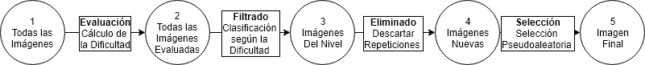

# Cambios a Realizar

Este capítulo va a constar de toda la documentación de la implementación que voy a realizar en el sistema.

## Algoritmos

El equipo de cazasteroides ha solicitado 3 algoritmos para implementar distintas dinámicas del sistema. Estos algoritmos tienen en común que la mecánica principal va a ser el Karma.

Estos algoritmos se tratan en primer lugar del específico para el cálculo del karma, ya que actualmente no se encuentra implementado, mientras que los dos siguientes serian variaciones de los algoritmos ya desarrollados, pero incluyendo como entrada el Karma del usuario.

Se busca que estos algoritmos sean modulables y fácilmente configurables, permitiendo asi, el poder variar las ponderaciones de las entradas incluso en caliente. De este modo, permitimos realizar pequeños ajustes utilizando el trafico real de la aplicación para lograr el equilibrio en el sistema.

### Algoritmo para el cálculo del Karma

Para el cálculo de este sistema de reputación se ha decidido dividir el progreso en niveles, a los cuales se iría llegando acumulando puntos, los cuales pueden ser obtenidos de distintas maneras. La manera principal para la obtención de estos puntos, y la que se va a utilizar de referencia en este algoritmo es la dinámica de la realización de observaciones.

Actualmente, para el cálculo de esta puntuación se utiliza el siguiente, el cual costa de 5 entradas ponderadas. Estas entradas son las siguientes.

1. **Tiempo** (**40%**): El usuario tendrá más puntos si encuentra el Asteroide más rápido.
2. **Orden en la detección** (**30%**): El primero en detectar un candidato tendrá la máxima puntuación.
3. **Probabilidad de encontrar un asteroide en el campo** (**10%**): (se calcula a partir de la latitud eclíptica del campo). Hay un header PROBA con ese valor. Para campos donde la probabilidad de encontrar un asteroide sea alta los puntos serán menos.
4. **Brillo o magnitud del asteroide** (**10%**): Si el brillo del asteroide es alto tendrá menos puntos que la detección de asteroides débiles. Al final del apartado coloco los detalles para calcular la magnitud de un asteroide a partir del máximo de luz.
5. **Seeing o fwhm** (**10%**): Existirá un parámetro en el header llamado FWHM que indicará el grado de turbulencia o “seeing” de la noche. Detectar un asteroide con mal seeing debería tener más puntos que con una buena noche.

// TODO explicar más esto

La ecuación final sumando todas las entradas es la siguiente Ecuación 1.

PuntosPorObservación = 40% Tiempo + 30% Orden + 10% Prob. + 10% Brillo + 10% Seeing

Ecuación 1: Puntos por Observación

Para el cálculo de los puntos necesarios para subir de nivel en este sistema se ha decidido utilizar una ecuación logarítmica, la cual se caracteriza por tener un valor muy bajo en un principio, subir muy rápido y acabar manteniéndose en un valor elevado, pero sin que aumente demasiado.

La ecuación utilizada para la obtención de estos valores se trata de la Ecuación 2 que se encuentra a continuación.

PuntosPorNivel (Nivel) = log (Nivel/3 + 1) * 3000;

Ecuación 2: Ecuación para el cálculo de los puntos por nivel

Como podemos ver, esta ecuación se trata de una logarítmica escalada y decelerada.

La gráfica de la puntuación, así como, la del número de observaciones que serán necesarias aproximadamente para superar cada uno de estos niveles se puede encontrar en la Imagen 1.

Imagen 1: Graficas Puntuación por Nivel y Observaciones por Puntuación. Obtenida de la aplicación Matlab

Como podemos ver estas graficas parten de un valor muy bajo donde los usuarios subirían rápidamente de nivel, durante los primeros niveles, este valor se iría incrementando de forma muy rápida también pero este aumento de puntuación se reduciría según va aumentando los niveles hasta apenas diferenciarse entre nivel y nivel. Esto se debe a que si se aumenta siempre en la misma proporción los niveles más altos requerirían demasiado trabajo lo que llevaría a los usuarios a dejar de intentar subir de nivel porque lo verían demasiado complicado.

### Algoritmo para la Selección de la Imagen a Mostrar

Para la selección de la imagen a mostrar se ha decidido implementar un algoritmo de tipo EFES (Evaluación-Filtrado-Eliminado-Selección). La característica principal de estos algoritmos es que permiten realizar selecciones sobre listas aplicado distintos criterios para lograr mejores resultados.

Estos algoritmos son modulares, se pueden intercambiar fases, siempre y cuando sean del mismo tipo, u omitirse en el caso de que alguna de las fases no fuese necesaria. Un esquema de cómo funcionan estos algoritmos puede verse en la Ecuación 3.

ImagenAMostrar = selección (eliminado (filtrado (Nivel, evaluación (todasLasImágenes))));

Ecuación 3: Pseudocódigo de un EFES.

Para este caso, se ha decido diseñar el EFES que se puede apreciar en la Imagen 2.

Imagen 2: Proceso de selección de una imagen. Generada con la aplicación Draw.io

1. **Evaluación, Cálculo de la Dificultad**: en esta primera fase se evaluarán las imágenes según una serie de parámetros configurables.
2. **Filtrado, Clasificación según la Dificultad**: en este método, y utilizando el valor obtenido de la fase anterior, clasificaremos todas las imágenes en distintos niveles. Estos niveles servirán para que los usuarios puedan acceder de forma rápida a ellos, ya que estas clasificaciones estarán cacheadas y no tendrán que ser calculados cada vez que un usuario requiera una nueva imagen. Estas dos fases van a ser ampliadas a continuación.
3. **Eliminado, Descartar Repeticiones**: con las imágenes seleccionadas por nivel, será necesario eliminar de esta lista las imágenes que ya hayan sido procesadas.
4. **Selección, Selección Pseudoaleatoria**: Para este último paso recibiremos como entrada las imágenes filtradas y no repetidas y, utilizando algún método para calcular valores psudoaleatorios, se seleccionará una imagen y se mandará al usuario.

Al dividir este proceso en distintas fases lo que conseguimos es incrementar la modularidad deseada. Además de poder utilizar las distintas fases de forma independiente y decidir cuál es la más adecuada. Estas fases están pensadas como métodos que reciben entradas y producen salidas.

#### Cálculo de la Dificultad de la Imagen

El primer paso de este algoritmo consistiría en evaluar todas las imágenes para poder tener de forma rápida los resultados de las imágenes. Para el cálculo de esta dificultad se ha calculado la siguiente ecuación (Ecuación 3), la cual recibe distintas entradas.

Dificultad = (1 / Probabilidad) * 40% + Seeing * 30% + (1 / numObservaciones) * 30%

Ecuación 3: Dificultad de una imagen, ecuación modificada

+ **Probabilidad**: este valor, como ya se analizó anteriormente, depende de la latitud eclíptica del campo.
+ **Numero Observaciones**: realizadas en la imagen, esta entrada sirve para que la imagen se ajuste con el tiempo. Estos dos últimos campos son inversamente proporcionales a la dificultad ya que cuanto mayores sean, menor será la dificultad de encontrar un asteroide.
+ **Seeing**: turbulencia que posee la imagen. Este valor es directamente proporcional ya que, cuanto mayor sea el seeing, mas turbulencia habrá en la imagen por lo que será más complicado encontrar un asteroide.

Este nivel de dificultad servirá para filtrar las imágenes que le pueden aparecer a los usuarios. Con esto lo que conseguiremos es mostrar a los usuarios inexpertos (con poco nivel de karma) imágenes que sean consideradas como fáciles. Mientras que a los usuarios expertos les enseñaremos imágenes de mayor dificultad.

#### Filtrado de Imágenes por nivel

Para la selección de las imágenes a filtrar se ha decidido catalogar las imágenes en distintos niveles según su dificultad, el cual viene determinado por el valor obtenido de la anterior fase.

En este caso se ha decidido utilizar 3 niveles de dificultad para las imágenes:

+ **Baja**: aquí tendremos las imágenes más fáciles, comprenderían imágenes entre un nivel de dificultad 0 y un nivel de dificultad 30.
+ **Media**: en esta categoría se encontrarían imágenes más complicadas que las anteriores, se encontrarían entre un nivel de dificultad 30 y 70.
+ **Alta**: en esta última categoría se encontrarían las imágenes más complicadas que hay en el sistema. Tendríamos dificultades de 70 en adelante.

Pero, tendremos 5 niveles de clasificación, esto se debe a que se van a incluir dos categorías intermedias donde se van a mostrar imágenes de dos niveles. Estas son: **Baja-Media**, y **Media-Alta**.

Se ha decidido hacer una distribución equitativa de los niveles de karma con los niveles de clasificación de las imágenes por lo que tendríamos una distribución de 10 niveles de karma por categoría. 

### Algoritmo para la Validación de la Observación

// TODO

## Referencias

1. <https://es.wikipedia.org/wiki/Seeing>
