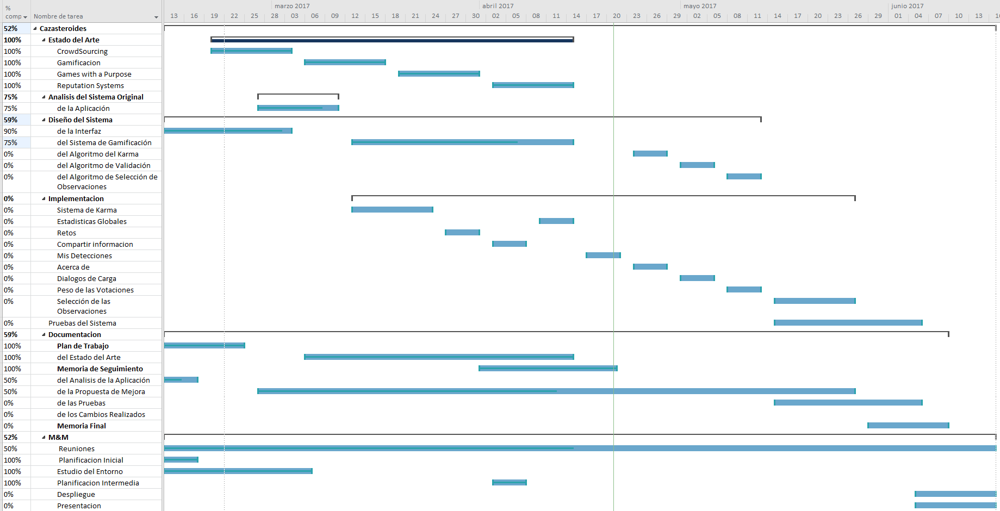

# Memoria de Seguimiento
## Resumen del trabajo realizado

Durante estas primeras semanas el trabajo realizado ha sido el siguiente.

+ Introducción de la aplicación. En este apartado se han realizado las dos primeras partes de la memoria, estas son el resumen, tanto en español como en inglés y el primer capitulo introductorio donde se ha ampliado el primer punto del plan de trabajo.
+ Estudio del entorno sobre el que están programadas las distintas partes del sistema. Se ha estudiado tanto web como node.js, los lenguajes de programación en los que esta hecho el front-end y el back-end del sistema respectivamente. Para este estudio se ha recurrido a tutoriales y a libros encontrados en internet.
+ Estudio del estado del arte de la aplicación. Se ha realizado un exhaustivo analisis de las distintas partes que componían el estado del arte del sistema, lo cual ha servido para entender cual es el estado actual de los juegos gamificados.
+ Análisis de la aplicación del sistema. Se ha estudiado cual es el estado actual de la aplicación del sistema para comprender como esta desarrollada.
+ Propuesta de mejora de la parte de la aplicación del sistema donde específicamente se ha realizado:
	+ Rediseño de la aplicación según los resultados obtenidos del análisis de la aplicación. Buscando lograr una aplicación más visual además de más navegable y organizado.
	+ Mejora del sistema de gamificación tras el estudio del Estado del Arte. Se ha ampliado el sistema de gamificación actual buscando ofrecer una experiencia más completa.

## Explicación y justificación de las modificaciones al Plan de Trabajo
### Revisión de la lista de objetivos del trabajo

Partiendo de la lista de objetivos planteadas en la etapa del plan de trabajo y tras la primera etapa, se han realizado modificaciones en la prioridad de los objetivos a cumplir. Estas prioridades han sido asignadas según la necesidades que desde el equipo de cazasteroides se han requerido. A continuación se muestran los objetivos a implantar:
+ Sistema de Karma para los usuarios
+ Mejorar el sistema de votaciones basándolo en función del karma
+ Función de selección de la imagen a mostrar
+ Mejora del sistema de gamificación
+ Añadir estadísticas de utilización del sistema.
+ Añadir un menú: “Mis detecciones” 
+ Añadir “Acerca de”.
+ Mejorar el perfil del usuario.
+ Interfaz mas atractiva y navegable

Mientras tanto, el resto de objetivos han quedado en segundo plano y serán realizados por otras partes del equipo o en el caso de que haya tiempo suficiente.

+ Proceso de registro inestable
+ Mejorar el back-end del astrónomo:
+ Nuevos estados (rechazado / pendiente) sobre las observaciones.
+ Añadir los nombres de usuarios a las observaciones.
+ Hacer el informe al MPC.
+ Identificar automáticamente los asteroides ya conocidos
+ Posibilidad de trabajar offline con una imagen y no consumir datos
+ Hay que escribir la documentación del proyecto (arquitectura, …)
+ Instalar la aplicación en varios servidores del IAC

### Revisión de la lista de tareas

Debido a los cambios en los objetivos, la lista de tareas a realizar también se ha visto alterada. La nueva lista de tareas se encuentra en la Tabla 1. 
En esta tabla, se han eliminado las tareas que se encuentran tachadas dado que ya no es necesario realizarlas al ya no ser necesario cumplir los objetivos a los que estaban asociadas. Mientras que las tareas.
Mientras tanto, las tareas en negrita corresponderían a las nuevas tareas que se deben completar para cumplir los nuevos objetivos.

|                           |                                 |                       		|                               |
| ------------------------- | ------------------------------- |---------------------------- | ----------------------------- |
| **Estado del Arte**       | CrowdSourcing                   | Gamificacion          		| **Games with a Purpose**      |
|                           | **Reputation Systems**                                                                 	    |
| **Análisis del Sistema**  | ~~de la Documentación~~         | de la Aplicación                                            |
| **Diseño del Sistema**    | de la Interfaz                  | del Sistema de Gamificación | **del Algoritmo del Karma**   | 
|                           | **del Algoritmo de Validacion** | **del Algoritmo de Seleccion de Observaciones**             |
| **Implementación**        | ~~Estado Votaciones~~           | Sistema de Karma            | Estadísticas Globales         |
|                           | Retos                           | Compartir en Redes Sociales | ~~Estabilidad General~~       |
|                           | Mis Detecciones                 | Acerca De 			        | Dialogos de Carga			    |
|						    | Peso de las Votaciones		  | Selección de las Observaciones						        |	
| **Pruebas**               | Pruebas al Sistema                                                                            |
| **Documentación**         | Plan de Trabajo                 | ~~del Sistema~~             | ~~del Código Original~~       | 
|                           | del Estado del Arte             | Memoria de Seguimiento      | del Analisis de la Aplicacion |
|                           | **de la Propuesta de Mejora**   | de las Pruebas              | **de los cambios realizados** |
|                           | ~~de la Implementación~~        | Memoria Final                                               |
| **M&M**                   | Reuniones                       | Planificación Inicial       | Presentación                  |
|                           | Planificación Intermedia        | Despliegue                  | Estudio del Entorno           |

### Revisión del Diagrama de Gantt

El nuevo diagrama de Gantt a partir de los nuevos objetivos y tareas se encuentra en la Imagen 1.

